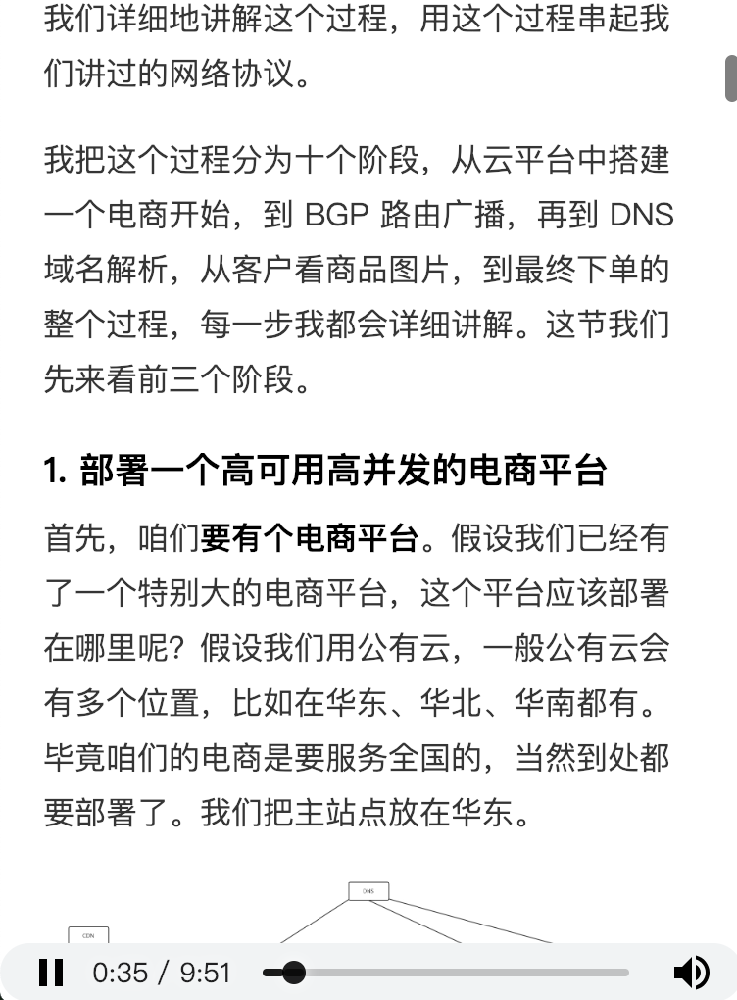

# 极客播
极客时间 PC 端音频播放插件

>请务必使用快捷键 q 开启播放，不然无法触发如下特性  
* 快捷键 q 控制播放/暂停
* 支持断点续播
* 播放进度调节

如上规则只在 `https://time.geekbang.org/column/article/*` 下生效。  

## Usage
**安装**  
1. chrome 浏览器输入 [chrome://extensions](chrome://extensions)
2. 开启开发者模式，
3. 拖入 `GeekAudio.crx` 到浏览器界面
4. 按提示安装

**效果预览**  




## 开发备忘
可以通过如下命令来生成 chrome 打包用的私钥  
```shell
openssl genrsa 2048 | openssl pkcs8 -topk8 -nocrypt -out key.pem
```
